# MLP SVHN Architecture and Results

## 1) Experiment Context

This notebook implements a multi-class (10-class) digit classification pipeline on Street View House Numbers (SVHN)-style data using a fully connected MLP baseline.

### Data and preprocessing used

- Input images are flattened to vectors of size `3072`.
- Features are standardized with `StandardScaler`.
- Labels are shifted from `1-10` format to `0-9` using `y_train_tf = y_train - 1` and `y_test_tf = y_test - 1`.
- Validation split is created from the scaled training set with stratification:
  - `train_test_split(..., test_size=(15/85), random_state=42, stratify=y_train_tf)`

## 2) Framework Architecture

The model is built by `build_MLP(hidden_units, drop_out, num_classes, learning_rate, loss)`.

### Implemented network structure

- Input: `3072`
- Hidden stack:
  - `Dense(hidden_units[0], relu)`
  - `Dropout(drop_out)`
  - `Dense(hidden_units[0], relu)`  (same width repeated)
  - `Dropout(drop_out)`
  - `Dense(hidden_units[1], relu)`
  - `Dropout(drop_out)`
  - `Dense(hidden_units[2], relu)`
  - `Dropout(drop_out)`
- Output: `Dense(10, softmax)`
- Optimizer: `Adam(learning_rate=...)`
- Loss: `sparse_categorical_crossentropy`
- Metric: `accuracy`

```mermaid
flowchart LR
    inputLayer["Input(3072)"] --> dense1["Dense(h0, ReLU)"]
    dense1 --> drop1["Dropout(p)"]
    drop1 --> dense2["Dense(h0, ReLU)"]
    dense2 --> drop2["Dropout(p)"]
    drop2 --> dense3["Dense(h1, ReLU)"]
    dense3 --> drop3["Dropout(p)"]
    drop3 --> dense4["Dense(h2, ReLU)"]
    dense4 --> drop4["Dropout(p)"]
    drop4 --> outputLayer["Dense(10, Softmax)"]
```

## 3) Hyperparameter Choosing and Optimizing Process

### Search space

The notebook runs a full Cartesian grid over:

- `hidden_units`: `[256, 128, 64]`, `[512, 256, 128]`
- `drop_out`: `0.3`, `0.05`
- `learning_rate`: `0.001`, `0.0005`
- `batch_size`: `64`, `128`

Total configurations: `2 x 2 x 2 x 2 = 16`.

### Optimization protocol

- Search loop uses `itertools.product`.
- Each candidate is trained for up to `15` epochs.
- `EarlyStopping(monitor="val_loss", patience=3, restore_best_weights=True)` is applied during search.
- Candidates are ranked by `val_accuracy` (descending).

### Best hyperparameters from the final search block

- `hidden_units`: `[256, 128, 64]`
- `drop_out`: `0.05`
- `learning_rate`: `0.0005`
- `batch_size`: `128`
- `val_accuracy`: `0.8429`
- `val_loss`: `0.5548`

Note: the notebook also contains an earlier exploratory search output (with a different grid) that reports a different best setting. The final model training cell uses the `best` object from the final search block above.

## 4) Final Training and Evaluation

### Final training setup

After selecting the best config, the final model is retrained with:

- `epochs=30`
- `batch_size=128`
- `EarlyStopping(monitor="val_loss", patience=5, restore_best_weights=True)`

### Learning behavior

From the logged training curve:

- Training accuracy rises steadily to about `0.90`.
- Validation accuracy improves to around `0.93` by late epochs.
- Validation loss decreases overall, with mild fluctuations, indicating stable optimization.

This suggests effective convergence with controlled overfitting for an MLP baseline.

### Final test results

- Test accuracy: **`0.8608`**
- Classification report:
  - Macro average F1: **`0.85`**
  - Weighted average F1: **`0.86`**

Class-wise observations:

- Stronger classes include `0`, `1`, `3`, `6` (high precision/recall balance around `0.89-0.91` on stronger ones).
- Weaker class is `7` with recall **`0.77`**, indicating more confusion relative to other digits.

## 5) Interpretation

### Advantages

- Simple and reproducible baseline pipeline.
- Hyperparameter tuning is explicit and auditable (small but complete grid).
- Converges stably with EarlyStopping and Adam.
- Achieves solid generalization (`86.08%` test accuracy) for a non-convolutional model.

### Limitations

- Flattened inputs discard image spatial structure, which limits representation power.
- Performance is likely below CNN-based approaches on SVHN-like tasks.
- Some class-level confusion remains (notably class `7` recall).
- Search space is small and may miss better configurations.

## 6) Recommended Next Steps

- Add CNN baseline for architecture-level comparison.
- Expand optimization strategy:
  - learning-rate scheduling
  - regularization/weight decay
  - wider/deeper search space
- Add data augmentation and compare impact on low-recall classes.

## 7) Reproducibility Notes

- Validation split is deterministic via `random_state=42`.
- Runtime (CPU vs GPU) affects training speed, but not the intended experiment logic.
- All reported metrics in this document are copied from notebook outputs (no synthetic values).
