# MLP SVHN Architecture and Results

## 1) Experiment Context

This notebook implements a multi-class (10-class) digit classification pipeline on Street View House Numbers (SVHN)-style data using a fully connected MLP baseline.

### Data and preprocessing used

- Input images are flattened to vectors of size `3072`.
- Features are standardized with `StandardScaler`.
- Labels are shifted from `1-10` format to `0-9` using `y_train_tf = y_train - 1` and `y_test_tf = y_test - 1`.
- Validation split is created from the scaled training set with stratification:
  - `train_test_split(..., test_size=(15/85), random_state=42, stratify=y_train_tf)`

## 2) Framework Architecture

The model is built by `build_MLP(hidden_units, drop_out, num_classes, learning_rate, loss)`.

### Implemented network structure

- Input: `3072`
- Hidden stack:
  - `Dense(hidden_units[0], relu)`
  - `Dropout(drop_out)`
  - `Dense(hidden_units[0], relu)`  (same width repeated)
  - `Dropout(drop_out)`
  - `Dense(hidden_units[1], relu)`
  - `Dropout(drop_out)`
  - `Dense(hidden_units[2], relu)`
  - `Dropout(drop_out)`
- Output: `Dense(10, softmax)`
- Optimizer: `Adam(learning_rate=...)`
- Loss: `sparse_categorical_crossentropy`
- Metric: `accuracy`

```mermaid
flowchart LR
    inputLayer["Input(3072)"] --> dense1["Dense(h0, ReLU)"]
    dense1 --> drop1["Dropout(p)"]
    drop1 --> dense2["Dense(h0, ReLU)"]
    dense2 --> drop2["Dropout(p)"]
    drop2 --> dense3["Dense(h1, ReLU)"]
    dense3 --> drop3["Dropout(p)"]
    drop3 --> dense4["Dense(h2, ReLU)"]
    dense4 --> drop4["Dropout(p)"]
    drop4 --> outputLayer["Dense(10, Softmax)"]
```

## 3) Hyperparameter Choosing and Optimizing Process

### Search space

The notebook runs a full Cartesian grid over:

- `hidden_units`: `[256, 128, 64]`, `[512, 256, 128]`
- `drop_out`: `0.3`, `0.05`
- `learning_rate`: `0.001`, `0.0005`
- `batch_size`: `64`, `128`

Total configurations: `2 x 2 x 2 x 2 = 16`.

### Optimization protocol

- Search loop uses `itertools.product`.
- Each candidate is trained for up to `15` epochs.
- `EarlyStopping(monitor="val_loss", patience=3, restore_best_weights=True)` is applied during search.
- Candidates are ranked by `val_accuracy` (descending).

### Best hyperparameters from the final search block

- `hidden_units`: `[256, 128, 64]`
- `drop_out`: `0.05`
- `learning_rate`: `0.0005`
- `batch_size`: `128`
- `val_accuracy`: `0.8429`
- `val_loss`: `0.5548`

Note: the notebook also contains an earlier exploratory search output (with a different grid) that reports a different best setting. The final model training cell uses the `best` object from the final search block above.

## 4) Final Training and Evaluation

### Final training setup

After selecting the best config, the final model is retrained with:

- `epochs=30`
- `batch_size=128`
- `EarlyStopping(monitor="val_loss", patience=5, restore_best_weights=True)`

### Learning behavior

From the logged final-training curve (30 epochs, EarlyStopping did not trigger):

- Training accuracy rises from about `0.55` (epoch 1) to `**0.90**` (epoch 30).
- Validation accuracy peaks around `**0.94**` (epoch 28: `0.9357`) and ends near `**0.93**` (epoch 30: `0.9312`).
- Validation loss falls steadily to about `**0.22**` by the last epoch, with small epoch-to-epoch noise (e.g. epochs 23 and 29).

Validation accuracy is consistently above training accuracy during late epochs. That pattern is expected here because **Dropout is active only during training**, so the model is evaluated under less regularization on the validation split.

### Final test results

- Test accuracy: `**0.8608`**
- Classification report:
  - Macro average F1: `**0.85**`
  - Weighted average F1: `**0.86**`

Class-wise observations:

- Strongest balance: digits `**0**`, `**1**`, `**3**` (F1 about `0.89-0.90`; recall `0.89-0.91`).
- Mid-tier: `**2**`, `**4**`, `**5**`, `**6**`, `**9**` (F1 about `0.83-0.87`).
- Weakest: `**7**` (recall `**0.77**`, F1 `**0.80**`), then `**8**` (recall `**0.81**`, F1 `**0.81**`).

## 5) Interpretation

### What the experiment shows

The pipeline works end-to-end: scaling, stratified validation, grid search, and a longer final fit all produce a usable MLP baseline. The grid is informative even at 16 runs—**lower dropout (`0.05`)** and **slower learning rate (`0.0005`)** consistently beat their alternatives, and the smaller width `[256, 128, 64]` edges out the deeper `[512, 256, 128]` stack on validation accuracy.

After retraining with the best config for 30 epochs, optimization is stable (loss and accuracy improve monotonically with only minor validation jitter). `**86.08%` test accuracy** is a reasonable result for a fully connected model on flattened `32×32×3` inputs, but it should be read together with the **validation–test gap**: held-out validation reaches about `**93%`** while the untouched test set stays at `**86%**` (~7 percentage points). That gap means validation metrics during training **overstate** performance on the final test split; the model is not “underfitting,” but **generalization to the test set is materially weaker than validation suggests**.

### Advantages

- Transparent, reproducible baseline (fixed `random_state=42`, explicit grid, logged metrics).
- Nonlinearity and dropout clearly help versus a linear baseline on the same preprocessing story.
- Per-class reports are balanced overall (macro F1 `**0.85`**, weighted F1 `**0.86**`), with several digits at ~`0.90` F1.

### Limitations and caveats

- **Spatial structure is discarded** by flattening; this caps accuracy relative to convolutional models on SVHN-style imagery.
- **Validation vs test mismatch** is the main reliability caveat: tune or early-stop on validation alone without a separate test check risks optimistic conclusions.
- **Class `7` is the clear weak point** (lowest recall); `**8`** is next, and `**4`/`5**` sit in a mid band—likely digit-shape and confusion-pair effects rather than a single global failure.
- The search grid is small (16 configs, 15 epochs per trial); best settings are plausible but not guaranteed globally optimal.
- Final training ran the full 30 epochs (EarlyStopping with `patience=5` did not fire), so there was no automatic rollback to an earlier checkpoint despite validation continuing to improve late in training.

## 6) Recommended Next Steps

- Add CNN baseline for architecture-level comparison.
- Expand optimization strategy:
  - learning-rate scheduling
  - regularization/weight decay
  - wider/deeper search space
- Add data augmentation and compare impact on low-recall classes.

## 7) Reproducibility Notes

- Validation split is deterministic via `random_state=42`.
- Runtime (CPU vs GPU) affects training speed, but not the intended experiment logic.
- All reported metrics in this document are copied from notebook outputs (no synthetic values).

